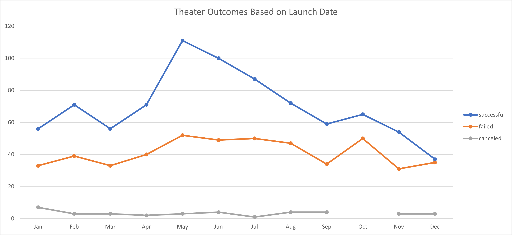
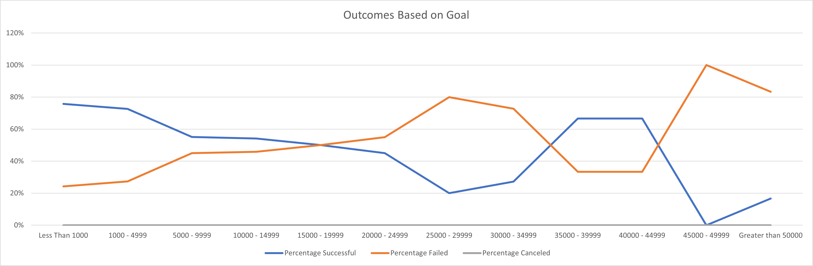

# Kickstarting with Excel

## Overview of Project

Louise is planning to launch a campaign to fund her new play *Fever* and would like to know the funding goals and launch dates can affect the successful rate of the campaign. 

### Purpose
The purpose of this analysis is to compare the outcome of fundraising campaigns for theters worldwide and to review how the launch dates and funding goals can be affect the success rate.

## Analysis and Challenges

### Analysis of Outcomes Based on Launch Date
For this part of the analysis, we have created the pivot table and line graph to compare the outcomea based on the launch date in all years worldwide. This can help us to determine the month(s) of the year with the highest successful. Based on the line graph created, we can conclude that May has the highest number of successful outcome follow by June and July and December is the lowest number of success. The line graph also showed that although the number of success started to decline in June, the number of failed campaigen between May to August are similar. 

### Analysis of Outcomes Based on Goals
For this part of the analysis, we used the countifs command to review the outcome of campaigns in certain funding goal ranges and for the purpose of this anaylsis, we focused on the outcome of campaign for plays under parent category of Theters. The line graph illustrated that with funding goal less than $5000 has the highest success rate and lowest rate of failure. 

### Challenges and Difficulties Encountered
The challenge could be encounter is when the countifs command is applied, we need to be very careful to ensure the goal ranges are entered in the correct order to avoid the error message and ensure to anchor the corresponding column correctly for the correct results. 

## Results

- What are two conclusions you can draw about the Outcomes based on Launch Date?
Lauching the campaign in May is very likely to be successful. Louise should avoids to launch in December given it has the lowest successful outcome. As alternative, Louise can also launch the campaign between June to August given the outcome of successful during these months are still relatively higher and the outcome of failed campaign during these months are very similar. 

- What can you conclude about the Outcomes based on Goals?
The funding goal of Louise campaign should be less than $5000 given it had the highest percentage of success and with funding goal over $45000 will very unlikely to be successful, follow by goal ranges between $20000 to $34999. 

- What are some limitations of this dataset?
The limitations can be the insufficient promotion of campaigns and people may show lack of interest based on the country where Louise decide to launch the campaign. We should also convert all currencies to single currencies for more accurate results for funding goal analysis. 

- What are some other possible tables and/or graphs that we could create?
The box and whisker can help us to determine whether the high funding goals are outliers as the successful rate was 0%. In addition, we can compare the outcomes based on country to see which country will have higher rate of success. 

